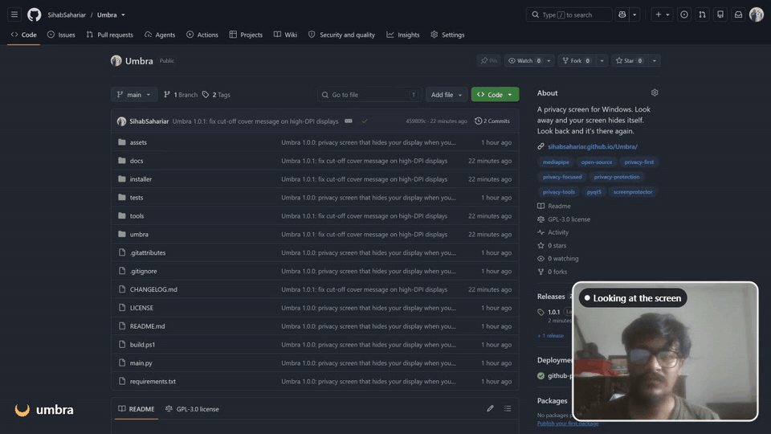

<p align="center">
  <picture>
    <source media="(prefers-color-scheme: dark)" srcset="assets/umbra-brand/logo/png/umbra-logo-light-1x.png">
    
  </picture>
</p>

<p align="center"><b>A privacy screen for Windows.</b> Look away and your screen hides itself. Look back and it's there again.</p>

<p align="center">
  <a href="https://github.com/SihabSahariar/Umbra/releases/latest/download/Umbra-Setup.exe">Download</a> ·
  <a href="https://sihabsahariar.github.io/Umbra/">Website &amp; manual</a> ·
  <a href="#for-developers">Developers</a>
</p>

<p align="center"></p>
<p align="center"><sub>A real recording: I look away, Umbra hides the screen; I look back, it's there again. The webcam view is in the corner.</sub></p>

Umbra uses your webcam and on-device face tracking to notice when you're not looking at your screen: head turned, eyes elsewhere, or away from your desk. It then covers every monitor until you look back. Video is processed in memory on your PC and is never recorded or uploaded.

## Features

- **Attention detection:** head direction and eye gaze from MediaPipe, with debouncing so blinks and quick glances don't trigger it.
- **Guided calibration:** a 10-step wizard fits the limits to you, your chair and your camera position.
- **Four cover styles:** live blur, your own image, an animated GIF or video, or a solid colour, with an optional message.
- **<kbd>F8</kbd> to toggle** from any app (the key is configurable). Pause for 5–60 minutes from the tray.
- **Safe to leave running:** the cover lets clicks pass through, and if the camera fails your screen stays visible.
- Multi-monitor, start with Windows, and an optional "someone else is looking" mode.

## For users

1. Download [`Umbra-Setup.exe`](https://github.com/SihabSahariar/Umbra/releases/latest/download/Umbra-Setup.exe) from the [latest release](https://github.com/SihabSahariar/Umbra/releases/latest) and run it. No admin rights are needed. A portable [`Umbra-win64.zip`](https://github.com/SihabSahariar/Umbra/releases/latest/download/Umbra-win64.zip) is also available: extract it and run `Umbra.exe`.
2. Umbra starts in the system tray as a crescent.
3. Follow the calibration wizard that opens on first launch: look at the centre and edges of your screen, then away. Press <kbd>Space</kbd> for each step.
4. That's it. Press <kbd>F8</kbd> to switch protection on or off, and right-click the tray icon for settings.

Requires Windows 10 or 11 and a webcam. The full manual, with screenshots and troubleshooting, is on the [website](https://sihabsahariar.github.io/Umbra/#manual).

## For developers

**Setup** (Python 3.10+ on Windows):

```powershell
pip install -r requirements.txt
python main.py            # --background: start silently in the tray, --debug: verbose logs
python -m pytest tests    # unit tests
```

**Build** a standalone app into `dist\Umbra\Umbra.exe`. Add `-Setup` to also compile the installer `dist\Umbra-Setup.exe`, which needs [Inno Setup 6](https://jrsoftware.org/isinfo.php):

```powershell
powershell -ExecutionPolicy Bypass -File build.ps1 -Setup
```

The installer script is `installer/umbra.iss`, and `tools/installer_images.py` regenerates its wizard artwork.

**Regenerate** the documentation screenshots in `docs/assets/img`:

```powershell
python tools/screenshots.py
```

**Project layout**

| Path | What's there |
|---|---|
| `main.py` | Entry point: logging, single-instance lock, hand-off to a running instance |
| `umbra/app.py` | Controller: tray menu, state, wiring |
| `umbra/tracker.py` | Webcam + MediaPipe face landmarker in a worker thread |
| `umbra/gaze.py` | Head-pose maths, per-frame decision, debounce *(unit tested)* |
| `umbra/calibration.py`, `calibration_wizard.py` | Calibration steps, threshold maths *(tested)*, full-screen wizard |
| `umbra/overlay.py` | Per-monitor cover windows and the blur / image / media / colour backdrops |
| `umbra/settings_dialog.py`, `preview.py`, `about_dialog.py` | Other windows |
| `umbra/hotkey.py`, `autostart.py`, `winutil.py` | Win32: global hotkey, start with Windows, capture exclusion |
| `umbra/config.py`, `brand.py`, `icons.py` | Settings (validated JSON), brand colours and assets |
| `assets/` | Face model and the Umbra brand kit |
| `installer/` | Inno Setup script and wizard images |
| `docs/` | Website (GitHub Pages) |

**How detection works:** the face landmarker returns a facial transformation matrix and ARKit-style blendshapes. Umbra turns the matrix's forward vector into yaw and pitch, and reads sideways gaze from the `eyeLook*` blendshapes. It compares these against limits measured by calibration, then passes the result through a state machine: away after 700 ms, back after 150 ms.

**Implementation notes**
- **Live blur:** it works because the cover windows use `WDA_EXCLUDEFROMCAPTURE` (Windows 10 2004+), so the screen behind them can still be captured.
- **Global hotkey:** registered with `RegisterHotKey`, so no keyboard hook is needed.
- **Storage:** settings live in `%APPDATA%\Umbra\settings.json` and logs in `%APPDATA%\Umbra\logs`.

**Publishing the website:** go to the repository's *Settings → Pages*, choose *Deploy from a branch*, select `main` and the `/docs` folder.

## Acknowledgements

Umbra is built on [MediaPipe](https://ai.google.dev/edge/mediapipe) (Apache 2.0), [OpenCV](https://opencv.org) (Apache 2.0), [PyQt5](https://www.riverbankcomputing.com/software/pyqt/) and [Qt](https://www.qt.io) (GPL v3 / LGPL v3), [NumPy](https://numpy.org) (BSD), [PyInstaller](https://pyinstaller.org) (GPL 2.0 with bootloader exception) and the [Geist](https://vercel.com/font) typeface (OFL). Thank you to their maintainers and contributors.

## License

Umbra is free software under the [GNU General Public License v3.0](LICENSE). You can use, study, share and modify it. If you distribute it, modified or not, you must do so under the same licence, with source code.

## Author

**Sihab Sahariar**: [sihabhabsahariarcse@gmail.com](mailto:sihabhabsahariarcse@gmail.com) · [LinkedIn](https://www.linkedin.com/in/sihabsahariar/)
